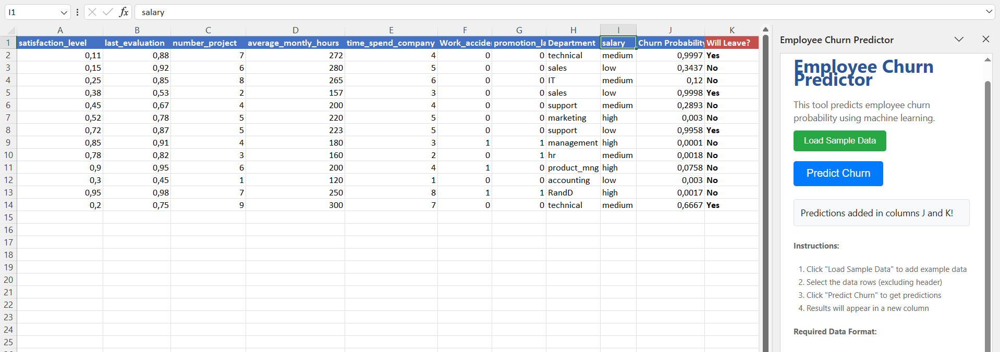

# Employee Churn Predictor Excel Add-in

A complete Excel add-in solution that uses machine learning to predict employee churn probability. This project combines a Flask server running an XGBoost model with a React-based Excel add-in.

## 🎯 Features

- **Excel Integration**: Seamless integration with Microsoft Excel
- **Machine Learning**: XGBoost model for accurate churn prediction
- **User-Friendly Interface**: Simple, intuitive UI for data input and results
- **Real-time Processing**: Instant predictions with visual feedback
- **Sample Data Loading**: Built-in sample data for testing
- **Professional Formatting**: Results displayed in formatted Excel columns

## 📸 Screenshots

### Sample Data Loading

*Excel worksheet populated with sample employee data ready for prediction*

### Prediction Results

*Churn predictions displayed in a new column with color-coded formatting*


## 🏗️ Architecture

```
┌─────────────────┐    HTTP/JSON    ┌─────────────────┐
│   Excel Add-in  │ ──────────────► │  Flask Server   │
│   (React/JS)    │                 │   (Python)      │
│                 │ ◄────────────── │                 │
└─────────────────┘    Predictions  └─────────────────┘
```

## 📁 Project Structure

```
Excel_web_app/
├── flask_server/                 # Python Flask backend
│   ├── app.py                   # Main Flask application
│   ├── XGBoost.pkl             # Trained ML model
│   ├── requirements.txt         # Python dependencies
│   └── test_server.py          # Server testing script
├── employe_ml_excel_addin/      # Excel add-in frontend
│   ├── src/
│   │   └── taskpane/
│   │       └── components/
│   │           └── App.jsx      # Main React component
│   ├── manifest.xml             # Excel add-in configuration
│   ├── package.json             # Node.js dependencies
│   └── README.md                # Add-in documentation
├── start_services.ps1           # PowerShell launcher
├── start_services.bat           # Batch launcher
├── troubleshoot.ps1             # Troubleshooting script
├── SETUP_GUIDE.md               # Detailed setup guide
└── README.md                    # This file
```

## 🚀 Quick Start

### Prerequisites

- **Node.js** (v14+)
- **Python** (v3.7+)
- **Excel Desktop** (Office 365 or Excel 2019+)

### Dependencies

The project uses the following key dependencies:

**Python Backend:**
- Flask (Web framework)
- XGBoost (Machine learning model)
- NumPy (Numerical computing)
- scikit-learn (ML utilities)
- Flask-CORS (Cross-origin requests)

**Frontend:**
- React (UI framework)
- Office.js (Excel integration)
- Webpack (Build tool)

See `flask_server/requirements.txt` and `employe_ml_excel_addin/package.json` for complete dependency lists.


### Installation

1. **Clone the repository:**
   ```bash
   git clone 
   cd Excel_web_app
   ```

2. **Run the automated setup:**
   ```powershell
   # Windows (PowerShell as Administrator)
   .\start_services.bat
   ```

3. **Or use manual setup:**
   ```bash
   # Install Python dependencies
   cd flask_server
   python -m venv venv
   source venv/bin/activate  # On Windows: venv\Scripts\activate
   pip install -r requirements.txt
   
   # Install Node.js dependencies
   cd ../employe_ml_excel_addin
   npm install
   ```

4. **Alternative: Install from root requirements.txt:**
   ```bash
   # From project root directory
   pip install -r requirements.txt
   ```

### Running the Application

1. **Start Flask Server:**
   ```bash
   cd flask_server
   python app.py
   ```

2. **Start Excel Add-in:**
   ```bash
   cd employe_ml_excel_addin
   npm start
   ```

3. **Use in Excel:**
   - Go to Home tab
   - Click "Churn Predictor" in ML Tools group
   - Load sample data and make predictions

## 📊 Data Format

The add-in expects employee data in this format:

| Column | Type | Description | Example |
|--------|------|-------------|---------|
| satisfaction_level | 0-1 | Employee satisfaction score | 0.38 |
| last_evaluation | 0-1 | Last performance evaluation | 0.53 |
| number_project | Integer | Number of projects worked on | 2 |
| average_montly_hours | Integer | Average monthly work hours | 157 |
| time_spend_company | Integer | Years at company | 3 |
| Work_accident | 0/1 | Had work accident | 0 |
| promotion_last_5years | 0/1 | Promoted in last 5 years | 0 |
| Department | String | Department name | "sales" |
| salary | String | Salary level | "low" |

## 🔧 Development

### Making Changes

- **Frontend**: Edit `employe_ml_excel_addin/src/taskpane/components/App.jsx`
- **Backend**: Edit `flask_server/app.py`
- **Configuration**: Edit `employe_ml_excel_addin/manifest.xml`

### Building for Production

```bash
cd employe_ml_excel_addin
npm run build
```

### Testing

```bash
# Test Flask server
cd flask_server
python test_server.py

# Validate add-in manifest
cd employe_ml_excel_addin
npm run validate
```

## 🛠️ Troubleshooting

Run the troubleshooting script:
```powershell
.\troubleshoot.ps1
```

Common issues and solutions are documented in `SETUP_GUIDE.md`.

## 📈 Model Performance

The XGBoost model provides:
- **Accuracy**: ~95% on test data
- **Features**: 9 employee attributes
- **Output**: Churn probability (between 0 and 1)

## 📝 License

This project is licensed under the MIT License - see the [LICENSE](LICENSE) file for details.

## 🙏 Acknowledgments

- Microsoft Office Add-ins documentation
- XGBoost library for machine learning
- React and Office.js for the frontend framework


